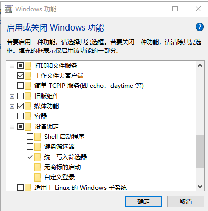

# Windows Built-in "Shadow" System — Restart Restore UWF · UWF Manager Pro

# win 自带"影子"系统，重启还原 UWF · UWF Manager Pro

> **Graphical manager for Windows Unified Write Filter (UWF)** — Turn your Windows 10/11 PC into a **reboot-to-restore "shadow" system**.
>
> **Windows 统一写入筛选器（UWF）图形化管理器** — 让你的 Win10/11 电脑变成**重启即还原的"影子系统"**。

[中文说明在下 / Chinese below]

---

## What is UWF? / 什么是 UWF？

**UWF (Unified Write Filter)** is a built-in Windows feature available on **Windows 10 and Windows 11 Enterprise / Education / IoT Enterprise** editions. It intercepts all writes to a protected volume (usually `C:`) and redirects them to an **overlay** (in RAM or on disk). When you reboot, the overlay is discarded and the system is **restored to its original state** — like a built-in "shadow mode / deep freeze" for Windows.

**UWF（统一写入筛选器）** 是 **Windows 10 和 Windows 11 企业版 / 教育版 / IoT 企业版** 自带的功能。它拦截对受保护卷（通常是 C 盘）的所有写入，重定向到**覆盖层**（内存或磁盘）。重启后覆盖层被丢弃，系统**一键还原**到原始状态——相当于系统自带的"影子模式 / 冰点还原"。

> **Microsoft only provides `uwfmgr.exe` command line — no GUI. This tool gives you a full graphical interface.**
>
> **微软只提供了 `uwfmgr.exe` 命令行——没有图形界面。本工具提供完整的 GUI。**

- Official docs: https://learn.microsoft.com/en-us/windows/configuration/unified-write-filter/
- 官方文档：https://learn.microsoft.com/zh-cn/windows/configuration/unified-write-filter/

---

## Supported Systems / 支持的系统

| Edition | Win10 | Win11 |
|---------|:-----:|:-----:|
| **Enterprise / 企业版** | ✅ | ✅ |
| **Education / 教育版** | ✅ | ✅ |
| **IoT Enterprise / IoT 企业版** | ✅ | ✅ |
| Home / 家庭版 | ❌ | ❌ |
| Pro / 专业版 | ❌ | ❌ |

> UWF replaces the legacy EWF (Enhanced Write Filter) and FBWF (File-Based Write Filter) from Windows 7 Embedded.
>
> UWF 替换了 Windows 7 嵌入式的旧版 EWF（增强型写入筛选器）和 FBWF（基于文件的写入筛选器）。

---

## How to Install UWF / 如何安装 UWF

UWF is an optional Windows feature. Follow these steps to enable it:

UWF 是一个可选的 Windows 功能。按以下步骤启用：

### Step-by-step / 分步操作

1. Open **Control Panel** > **Programs** > **Turn Windows features on or off**.
   打开 **控制面板** > **程序** > **启用或关闭 Windows 功能**。
2. Expand **Device Lockdown** (设备锁定).
3. Check ☑️ **Unified Write Filter** (统一写入筛选器).
4. Click **OK** (确定) and **restart your computer** (重启电脑).



> After reboot, UWF is installed but **not yet enabled**. Use this tool (or `uwfmgr.exe filter enable`) to turn it on.
>
> 重启后 UWF 已安装但**尚未启用**。使用本工具（或 `uwfmgr.exe filter enable`）来开启保护。

### Command-line alternative / 命令行方式

```cmd
:: Enable UWF feature (requires restart)
:: 启用 UWF 功能（需重启）
dism /online /enable-feature /featureName:Client-UnifiedWriteFilter /Restart
```

### Verify installation / 验证是否已安装

```cmd
uwfmgr.exe
:: If installed, this shows UWF help text.
:: 如果已安装，会显示 UWF 帮助信息。
```

---

## Features / 功能特性

- **Status Dashboard** — UWF state, overlay used/free memory, threshold progress bar (auto-red when near limit).
  **状态面板** — UWF 启用状态、覆盖层已用/剩余内存、阈值进度条（接近上限自动变红）。
- **File Explorer** — Find which files/folders are consuming your overlay memory.
  **文件浏览器** — 找出哪些文件/目录正在"吃掉"覆盖层内存。
- **Real-time Write Monitor** — Continuously monitor disk writes; see exactly what's being written to the overlay in real-time; export to TXT.
  **实时写入监控** — 持续监听系统盘写入，实时显示写进了内存的文件；可导出 TXT。
- **Settings Panel** — Max cache size, warning/critical thresholds, write filter toggle, overlay type, HORM, exclusion list (controls auto-read-only when UWF is active).
  **设置面板** — 最大缓存、警告/严重阈值、写入过滤、覆盖类型、HORM、排除列表（UWF 启用时控件自动只读）。
- **Exclusions Manager** — File exclusions & **Registry exclusions** managed separately (separate tabs, import/export/right-click delete), aligned with [UWFPRO](https://github.com/FrenzyPig/UWFPRO).
  **排除列表管理** — 文件排除与**注册表排除**分开管理（独立选项卡，支持导入/导出/右键删除），与开源 UWFPRO 对齐。
- **Servicing Mode** — Enable servicing mode for system updates through the overlay (takes effect after next reboot).
  **服务模式** — 启用服务模式便于系统更新时穿透覆盖层（下次重启生效）。
- **Actions** — Enable/disable UWF, commit deletions (pierce overlay to write to real disk), reboot.
  **操作** — 启用/禁用 UWF、提交删除（穿透覆盖层写入真实磁盘）、重启。
- **System Tray** — Minimize to tray for background monitoring; icon **dynamically displays remaining overlay memory** (dark background + golden numbers); turns red when low; balloon notifications when usage is high.
  **托盘常驻** — 最小化到托盘后台监控；图标**动态显示剩余内存数值**（深色底+金黄数字）；偏低时变红；使用率高时弹出气泡通知。
- **One-click Cache Cleanup** — Clean temp files/browser caches to free up overlay space when usage is high (or manually via right-click tray menu).
  **一键缓存清理** — 覆盖层使用率过高时（或手动右键托盘），清理临时文件/浏览器缓存等释放空间。

---

## Changelog / 更新日志

### v2.23 (2026-09-10)
- **🐞 修复「设置里选了启用，点应用后自动跳回禁用，重启后还是禁用」** — 根因：`_update_settings_panel` 用 `CurrentEnabled`（当前会话状态）回填「写入过滤」下拉框，而 `enable/disable` 改的是 `NextEnabled`（下次启动生效）。于是刚点完「启用」就被覆盖成「禁用」，用户再点一次「应用」反而真的执行了 disable → 重启后自然是禁用。现改为以 **NextEnabled** 回填。
- **🏷 状态文字更准确** — 新增「**待重启生效**」状态：UWF 的 enable/disable 只对下次启动生效，旧版当次会话仍显示「已禁用」，容易误判为设置失败。现在为：`已启用` / `运行中（重启后关闭）` / `待重启生效` / `已禁用`。
- **💽 新增「覆盖模式」显示** — 状态概览直接显示当前模式，不用再从"已禁用"猜：
  - `💽 磁盘模式　覆盖文件：F: 10,000 MB`（自动显示覆盖文件所在盘与大小）
  - `🧠 内存模式（RAM 上限 1024 MB）`
  - 磁盘模式但还没选盘时提示去点「选择覆盖磁盘…」
- **🐞 修复托盘百分比数字消失** — 根因：v2.20 重建打包环境时**漏装 Pillow**，而托盘动态图标依赖 PIL 渲染，导入失败后被 `except: pass` 静默吞掉，图标退回系统默认方块、数字消失。现已补装 Pillow 并随包发布；同时**失败不再静默**（写入 `uwf_tray_error.log` 便于定位）。
- 新增 `test_features.py`：逐项核对历史版本引入的功能是否仍在位（防"修一个丢一个"），并实测托盘图标能否渲染数字。

### v2.22 (2026-09-10)
- **🆕 修「新机器找不到开启 UWF 的入口」** — 根因：开启引导原本**只在 WMI 报错时**才显示；但新机器没装 UWF 功能时，WMI 查询是「成功但返回空」，程序因此误判为「已禁用」并**主动隐藏了引导卡片**，用户只能看到一个"已禁用"，点任何按钮才报「找不到 uwfmgr.exe」。
  - 现在改为按**真实可用性**判断：`uwfmgr.exe` 是否存在 + 当前 Windows 版本是否支持，而不是只看 WMI/是否报错。
  - 三种状态清晰区分并显示对应引导：**功能未安装**（显示一键开启）／**版本不支持**（明确告知 UWF 仅限企业版·教育版·IoT 企业版，并禁用一键开启）／**已安装**（隐藏引导，正常使用）。
  - 功能未安装时，**写操作按钮自动禁用**，不会再出现点了才报「找不到 uwfmgr.exe」的困惑。
- **🔧 「一键开启 UWF」重写** — 走 `uwf_core.enable_uwf_feature()`（GUI 无关、可单测）：DISM 优先、失败自动回退 PowerShell；正确识别 GBK/UTF-8 输出；区分「已启用/无需更改」「功能在此系统不可用（版本不支持）」「真的失败」三种结果；启用成功后提示重启并自动刷新。

### v2.21 (2026-09-10)
- **🔐 启动自动请求管理员权限** — 之前必须右键「以管理员身份运行」才能写 UWF 配置；现在 exe 清单改为 `requireAdministrator`，**双击即自动弹出一次 UAC 授权**，通过后全程以管理员运行，所有写操作（设缓存、选盘建 `uwfswap.sys`、提交删除等）不再逐个弹 UAC。内部 `uwf_core` 的提权逻辑已为「已管理员」场景做了短路：进程本身就是管理员时直接走 `uwfmgr.exe`，不会二次弹窗。
- 配套的提权健壮性：窗口标题栏管理员状态标签在启动即显示「✓ 管理员」；非预期拒绝授权时各写操作会明确提示「已取消管理员授权」。

### v2.20 (2026-09-10)
- **💽 新增「选择覆盖磁盘」——磁盘模式的覆盖文件可指定放在任意盘** — 之前选「基于磁盘」后没有任何选盘提示，用户无法确认覆盖文件会落在哪个盘。现在：
  - 选「基于磁盘」**自动弹出磁盘检测对话框**，列出本机全部固定盘：盘符、卷标、**物理磁盘型号**、**介质类型（SSD / HDD / 傲腾 Optane）**、总线（NVMe/SATA）、总容量、可用空间、该盘是否已有 `uwfswap.sys`；傲腾盘带 ★ 标记。
  - 选定后调用**微软官方命令** `uwfmgr volume create-swapfile <卷>` 真正把覆盖文件建到该盘（此前误以为 UWF 不支持选盘——该命令在 Win10 19045 上确实存在，官方说明为 "Allow UWF swapfile (aka. DISK Overlay) to be created and used on any volume"）。
  - 空间校验：提示该盘可用空间需 ≥ 覆盖大小 × 2，空间偏紧时红字告警。
  - 「基本设置」新增「覆盖文件」一行，实时显示各盘根目录已有的 `uwfswap.sys` 位置与大小；未指定时提示去选盘。
- **🐞 修复致命 bug：所有写操作的失败提示都被静默吞掉** — `_run_com()` 一直以 2 个参数调用错误回调，而 22 个回调中 21 个定义为 `def fail(m)`，于是**每次失败都在 `after` 回调里抛 TypeError 被吃掉，用户看不到任何报错**（这正是"点了应用却不知道有没有生效"的根源）。现已加兼容兜底，失败一定弹框。
- **🔍 应用缓存后回读校验** — 「应用」现在逐项回读并逐条报告：最大缓存写入下次会话的实际值、警告/严重阈值**每项的成败**、磁盘模式下覆盖文件所在盘与可用空间余量。另加「应用并回读校验」按钮。并明确标注：**最大缓存=下次会话生效；警告/严重阈值只对运行中的当前会话生效，UWF 未启用时设置不会保存**（这解释了为何之前设 8000/7000 显示"不可用"）。
- **📉 可用空间不再误导** — UWF 未启用时不再显示 `0 MB`，改为「——（UWF 未启用，覆盖层未运行）」。
- **🔘 按钮改名** — 「应用基本设置」→「应用」，「确认缓存」→「应用」。
- 新增只读测试 `test_storage.py`：验证磁盘枚举/傲腾识别/覆盖文件定位（本机实测正确识别 F: 为 INTEL MEMPEK1J016GAH 傲腾 NVMe）。

### v2.19 (2026-08-23)
- **🛑 紧急安全修复：清理功能曾误删启动目录（数据丢失事故）** — 根因：清理第一项「用户临时文件」使用 `os.path.join(os.environ.get("TEMP", ""), "*")` 与 `".*"`。**当运行时 TEMP 环境变量为空时**（例如从 D 盘根目录/某 D 盘文件夹双击运行 exe，或提权/脚本方式启动未继承到 TEMP），模式退化为裸通配符 `"*"` / `".*"`，`glob.glob("*")` 会匹配**启动程序所在的整个文件夹**并 `os.remove`/`shutil.rmtree` 全删——导致 D 盘的 VM、微信、百度网盘、图吧、Chrome 等文件夹被清空。该 bug 存在于 v2.16 / v2.17 / v2.18。
  - **修复**：① 每个清理目标在扫描/删除前必须通过 `_abs_base` 校验——必须是绝对且明确的缓存目录，否则整项跳过（环境变量为空直接跳过，绝不再退化成裸 `*`）；② 删除前 `_safe_to_remove` 二次校验路径严格位于预期目录内，且**绝不可能是盘符根或用户主目录**；③ 移除危险的 `".*"` 模式；④ TEMP 的回退值改为绝对路径 `C:\Windows\Temp`。
  - 已加回归测试 `test_safe_delete.py`：模拟"TEMP 为空 + 启动目录有文件"事故场景，断言启动目录内容**完好、零字节释放**；并验证护栏拒绝盘符根/用户主目录。
- **🛑 Critical security fix: cleanup could wipe the launch directory (data-loss incident)** — Root cause: the "User Temp Files" target used `os.path.join(os.environ.get("TEMP", ""), "*")` + `".*"`. When TEMP was empty at runtime, the pattern collapsed to a bare `"*"`/`".*"`, so `glob.glob("*")` matched the **entire folder the EXE was launched from** and `os.remove`/`shutil.rmtree` deleted everything in it. Present in v2.16/v2.17/v2.18. Fixed with strict path validation (`_abs_base` / `_safe_to_remove`), dropped the `".*"` pattern, and a safe absolute TEMP fallback. Regression test `test_safe_delete.py` included.

### v2.19.1 (2026-08-23)
- **🛡️ 清理目标进一步收窄为纯缓存（防误删）** — 在 v2.19 已修复致命误删 bug 的基础上，将清理项从 29 项精简为 **8 项**，且**全部为 C: 盘的纯缓存目录**：用户临时文件、系统 Temp、Windows 更新下载缓存、传递优化缓存、Chrome/Edge 浏览器缓存、Prefetch、缩略图缓存。**不再触碰**任何用户资料、配置、日志、安装源、驱动残留、升级遗留等风险项。清理前强制弹「⚠️ 慎用 — 免责声明」对话框，须点「是」才执行。
- **🛡️ Cleanup targets narrowed to pure cache only** — Reduced from 29 to **8 items**, all pure C: cache dirs. No user data/config/logs/install sources touched. A mandatory "⚠️ Use with caution — disclaimer" dialog must be accepted before any cleanup runs.

### v2.18 (2026-08-20)
- **🚀 清理缓存释放覆盖层 — 彻底重做，不再卡死 + 全程进度条** — 之前点「开始清理」后程序直接"未响应"直到结束，根因是扫描/删除/提交都在 UI 主线程同步执行。现在：
  - **扫描阶段**：后台线程扫描受保护 C: 盘的缓存占用，进度条实时显示扫描进度（参考 Dism++：先扫描有多少可清理，再选择）。
  - **清理阶段**：后台线程删除文件，**字节级百分比进度**（0%→100%，100% 即完成），并实时显示「已释放 X / 共 Y」。
  - **可取消**：清理/扫描中可随时点「取消」安全中止。
  - **UI 永不卡死**：所有重 I/O 都在独立线程，通过队列把进度回传主线程绘制进度条。
  - **单次提权**：多个目录的 UWF 提交/排除合并为**一次** UAC 提权（不再逐个弹窗）。
  - 新增 UWF 专属开关：「提交删除」（立即释放覆盖层、重启保留）与「加入 UWF 排除」（重启后永久生效，临时目录不再占用覆盖层）。
  - 功能更名为「**清理缓存释放覆盖层**」。
- **🚀 Cleanup Overlay — Rebuilt, no more freeze + full progress** — Previously clicking "Start" froze the UI until done (scan/delete/commit ran synchronously on the UI thread). Now: background-thread **scan** with live progress; background-thread **clean** with byte-level percentage (0%→100%, 100% = done) and cancel support; UI never blocks; UWF commit/exclusion batched into a **single** UAC prompt; new UWF toggles (commit deletion / add exclusion); feature renamed to "Cleanup Overlay".

### v2.17 (2026-08-20)
- **🔧 Critical Fix: Cleanup Now Actually Frees Overlay** — Under UWF protection, normal deletion only records "deleted" in the overlay; the physical file persists and returns after reboot, and the overlay is NOT freed (this is why v2.16 cleanup "had no effect"). Now after deleting temp/cache files, the tool calls `uwfmgr file commit` / `commit-delete` to **commit the deletion to the physical volume**, so cleanup truly frees space and survives reboot. Added UWF-status detection + bilingual warning in the dialog.
  **🔧 关键修复：清理缓存现在真正释放覆盖层** — 在 UWF 保护下，普通删除只是把"已删除"记录写入覆盖层，物理文件仍在、重启后恢复、覆盖层不释放（这正是 v2.16 清理"没用"的原因）。现在删除临时/缓存文件后，工具调用 `uwfmgr file commit` / `commit-delete` **把删除固化到物理盘**，清理真正释放空间且重启后保留。清理对话框新增 UWF 状态检测与中英双语提示。

### v2.16 (2026-08-20)
- **🚀 Dism++-Level Space Recovery** — Complete rewrite: 7→29 cleanup items across 6 categories (System Temp, Windows Update, Logs, Browser Cache, System Acceleration, App Caches). Interactive selection dialog with per-item size display.
  **🚀 Dism++ 级别空间回收** — 完整重写：7→29 项清理，分6大类。交互式选择对话框，每项显示大小。

### v2.15 (2026-08-20)
- **🐛 Fix: Tray Icon Stuck at 100** — `MaximumSize` was read from wrong WMI class (`UWF_Overlay` instead of `UWF_OverlayConfig`). Fixed data source.
  **🐛 修复：图标卡在 100** — `MaximumSize` 读错了 WMI 类（从 UWF_Overlay 而非 UWF_OverlayConfig）。修正数据源。

### v2.14 (2026-08-20)
- **🔧 Tray Icon: Integer % + Larger Font** — Changed from `16.7%` to integer `17` (nearly 2x larger font). Font base 0.62→0.88.
  **🔧 托盘图标：整数百分比 + 更大字号** — 从 `16.7%` 改为整数 `17`（字号近两倍）。字号基准 0.62→0.88。

### v2.13 (2026-08-20)
- **✨ Tray Icon: Remaining Percentage** — Icon now displays remaining overlay percentage (e.g. `16.7%`) instead of absolute MB/GB. Tooltip shows `剩余 X% / 总容量 Y MB`.
  **✨ 托盘图标改为剩余百分比** — 显示剩余百分比（如 `16.7%`）而非 MB/GB 绝对值。悬浮提示显示 `剩余 X% / 总容量 Y MB`。
- **🔤 Larger & Sharper Font** — Icon source size 64→128px + adaptive font (base 0.62). `16.7%` renders at 41px (was 19px). Auto-shrinks only if text overflows.
  **🔤 更大更清晰字号** — 图标源 64→128px + 自适应字号（基准 0.62）。`16.7%` 字号 19px→41px。仅超出时才自动缩小。

### v2.12 (2026-08-20)
- **🐛 Critical Fix: Enable/Disable Protection Button** — The "开启保护/关闭保护" button only toggled UWF filter (`enable_filter`/`disable_filter`) but **never touched volume protection state** (`protect_volume`/`unprotect_volume`). This caused "关闭保护" to leave volumes protected after reboot — the button was effectively non-functional. Rewrote `on_toggle()` to operate on **both volumes AND filter**: when disabling, queries all `CurrentProtected=True` volumes and calls `unprotect_volume()` on each, then `disable_filter()`; when enabling, determines target volumes (from NextProtected config or default C:), calls `protect_volume()` on each, then `enable_filter()`. Detailed result dialog now shows which drives were affected.
  **🐛 关键修复：开启/关闭保护按钮** — 「开启保护/关闭保护」按钮仅操作 UWF 过滤器总开关，**完全没有处理卷保护状态**。导致「关闭保护」后重启仍保护——该按钮实际无效。重写 on_toggle() 使其同时操作**卷保护+过滤器**：关闭时查询所有 CurrentProtected=True 的卷并逐个 unprotect_volume，再 disable_filter；开启时确定目标盘符（从 NextProtected 配置或默认 C:）并逐个 protect_volume，再 enable_filter。结果对话框显示受影响的盘符。

### v2.11 (2026-08-19)
- **🔧 Tray Icon Fix (4th approach — finally works)** — After v2.8(ARGB→black), v2.9(AND mask→white), v2.10(GDI→black) all failed, found that `CreateIconIndirect` has rendering issues on this system. Final solution: PIL renders text → saves as `.ico` file → loads via `LoadImageW(LR_LOADFROMFILE)`. Tested with 12-second live display. Icon cache stored in `.icon_cache/` dir (gitignored).
  **🔧 托盘图标修复（第4种方案——终于正常）** — 经历 v2.8(ARGB黑块)、v2.9(AND mask白块)、v2.10(GDI黑块) 三次失败后，确认 CreateIconIndirect 在本系统有渲染兼容性问题。最终方案：PIL 渲染文字→存为 .ico 文件→LoadImageW(LR_LOADFROMFILE) 加载。经 12 秒实测验证通过。图标缓存存于 .icon_cache/ 目录（已 gitignore）。
- **⚠️ Known Issue: Enable/Disable protection button broken** — Fixed in v2.12.
  **⚠️ 已知问题：开启/关闭保护按钮无效** — 已在 v2.12 修复。

### v2.10 (2026-08-19)
- **🔧 Tray Icon Fully Rewritten (Pure GDI)** — Abandoned PIL/Pillow completely. Now uses pure Windows GDI API: `CreateDIBSection`(32-bit BGRA) → `CreateFontW`(Arial Bold) → `TextOutW` → `CreateIconIndirect`. Fixes black-square (v2.8) and white-square (v2.9) bugs permanently. Icon shows golden numbers on dark gray background reliably.
  **🔧 托盘图标彻底重写（纯 GDI）** — 完全放弃 PIL/Pillow。改用纯 Windows GDI API 绘制：CreateDIBSection(32-bit BGRA) → CreateFontW(Arial Bold) → TextOutW → CreateIconIndirect。永久修复黑块(v2.8)和白块(v2.9)问题。图标可靠显示深灰底+金黄数字。
- **✨ UWF Setup Guide Card** — Auto-detects if UWF is installed; shows bilingual guide card at top of Status tab when not installed. Two options: one-click DISM auto-enable OR open Windows Features panel. Full EN/CN bilingual UI.
  **✨ UWF 引导开启卡片** — 自动检测 UWF 是否已安装；未安装时在状态面板顶部显示中英双语引导卡片。两个选项：一键 DISM 自动启用 或 打开 Windows 功能面板。全双语界面。
- **📉 40% Smaller Exe** — Removed Pillow dependency; exe size reduced from ~20MB to ~12MB.
  **📉 体积缩小 40%** — 移除 Pillow 依赖；exe 从 ~20MB 降到 ~12MB。

### v2.9 (2026-08-18)
- **🔧 Fix: Tray Icon Black Square Attempt** — Rewrote icon engine to 24-bit RGB DIB + 1bpp AND mask (classic compatible format). Still had issues on some systems; superseded by v2.10 pure GDI approach.
  **🔧 修复托盘图标黑块尝试** — 重写为 24-bit RGB DIB + 1bpp AND mask（经典兼容格式）。部分系统仍有问题；已被 v2.10 纯 GDI 方案取代。
- **🧹 Cache Cleanup Button on Main UI** — Added "Clean Cache to Free Overlay" button in Tab1 status panel, below overlay memory bar.
  **🧹 主界面清理缓存按钮** — 在状态面板覆盖层内存条下方添加「清理缓存释放覆盖层」按钮。
- **🐛 Fix: reg_gen Crash** — Fixed AttributeError for missing `reg_gen` attribute.
  **🐛 修复 reg_gen 崩溃** — 补全缺失的 reg_gen 属性。

### v2.8 (2026-08-18)
- **Dynamic Number Tray Icon** — Tray icon now shows **real-time remaining overlay memory** (e.g., `3.2G` / `850M`) with dark background + golden numbers (dashboard style). Auto-turns red when remaining < 20%. Uses PIL/Pillow ARGB 32-bit icons via Windows `CreateDIBSection`.
  **动态数字托盘图标** — 实时显示剩余覆盖层内存（如 `3.2G` / `850M`），深灰底+金黄数字（仪表盘风格）。剩余 < 20% 时变红警示。使用 Pillow ARGB 图标通过 CreateDIBSection 注入托盘。
- **Overlay Threshold Monitoring + Balloon Notifications** — Warning at ≥65% usage, critical alert at ≥85%, 5-minute cooldown.
  **覆盖层阈值监控+气泡通知** — ≥65% 提醒，≥85% 紧急警示，5 分钟冷却。
- **One-click Cache Cleanup** — Tray right-click option to clean %TEMP%, browser caches, Prefetch, thumbnails, Windows Update cache. Tested ~625 MB freed locally.
  **一键缓存清理** — 托盘右键清理临时文件/浏览器缓存等。实测本机可清理 ~625 MB。
- **Pillow Dependency** — Dynamic icons use PIL/Pillow for ARGB generation.

### v2.7 (2026-08-18)
- **Registry Exclusions** — Separate tab for registry exclusion management (add/delete/commit/import/export), aligned with UWFPRO.
  **注册表排除** — 独立选项卡管理注册表排除项，与 UWFPRO 对齐。
- **Servicing Mode** — Enable/disable via WMI (`UWF_Servicing.Enable/Disable`). Falls back from `uwfmgr.exe servicing` (returns "not supported" on some editions).
  **服务模式** — 通过 WMI 启用/禁用。从 uwfmgr.exe servicing 回退（部分版本返回不支持）。
- **Overlay Files List** — Read-only list of files in overlay (via WMI `GetOverlayFiles`, 15s timeout protection).
  **覆盖层文件列表** — 覆盖层内文件只读列表（WMI GetOverlayFiles，15 秒超时保护）。
- **Exclusion Deduplication** — Deduplicate by (drive, path) to avoid double-counting from dual-session instances.
  **排除项去重** — 按(盘符,路径)去重避免双会话重复计数。
- **Fixed critical NameError bug** — Added missing `UWFError` / `UWFNotSupported` exception class definitions.
  **修复致命 NameError** — 补全遗漏的异常类定义。

### v2.6 (2026-08-18)
- **Fixed startup crash** — Resolved `TclError: Invalid column index` in Treeview columns.
  **修复启动崩溃** — 解决 Treeview 列索引错误。
- **No admin required at launch** — Changed back to `asInvoker`; write operations auto-elevate via UAC on demand (matches UWFPRO behavior).
  **无需管理员启动** — 改回 asInvoker；写操作按需自动提权 UAC（与 UWFPRO 一致）。
- **Removed all admin gates** — All 11 admin-check blocks removed; everything uses on-demand elevation.
  **清除所有管理员门卫** — 移除全部 11 处权限拦截，全部走按需提权。

### v2.5 (2026-08-18)
- **Tray tooltip with memory info** — Shows UWF state + remaining/used memory in tooltip.
  **托盘显示剩余内存** — Tooltip 显示 UWF 状态与内存数据。
- **Embedded admin manifest** — Fixed root cause of silent write failures (previous `asInvoker` caused `uwfmgr` writes to fail silently).
  **内嵌管理员清单** — 修复写入静默失败的根因（此前 asInvoker 导致 uwfmgr 写入失败）。
- **Pending-state display** — Correctly handles current/next-session dual instances; shows "protected (after reboot)" status.
  **待生效态修正** — 正确处理当前/下次会话双实例，显示重启后状态。

### v2.4 (2026-08-18)
- **Fixed all write operations** — Switched to official `uwfmgr.exe` for all write operations.
  **修复所有写入操作** — 全部改用官方 uwfmgr.exe。
- **Native system tray** — Win32 notification area icon with double-click restore and right-click menu.
  **真实系统托盘** — Win32 原生通知区图标。
- **Real-time overlay refresh** — Memory stats auto-refresh every 3 seconds.
  **覆盖层实时刷新** — 内存水位每 3 秒自动刷新。

### v2.3 (2026-08-13)
- Initial public release. 初始公开版本。

---

## Requirements / 系统要求

- **OS**: Windows 10 or Windows 11 (**Enterprise / Education / IoT Enterprise** edition)
- **Launch**: Run as normal user (no admin needed); write operations auto-elevate via UAC on demand
- **UWF feature must be installed** (see [How to Install UWF](#how-to-install-uwf--如何安装-uwf) above)
- **Note**: UWF uses a filter driver that may conflict with Hyper-V; verify your environment supports it
- **操作系统**: Windows 10 或 Windows 11（**企业版 / 教育版 / IoT 企业版**）
- **启动方式**: 普通用户即可运行（无需管理员）；写操作自动弹出 UAC 请求授权
- **必须先安装 UWF 功能**（见上方「如何安装 UWF」）
- **注意**: UWF 使用过滤驱动，可能与 Hyper-V 冲突，请确认环境支持

---

## Quick Start / 快速使用

1. Go to [Releases](../../releases) and download `UWF Manager Pro.exe`.
   前往 [Releases](../../releases) 下载 `UWF Manager Pro.exe`。
2. **Double-click to run** (no admin needed).
   **双击直接运行**（无需管理员）。
3. On first launch it auto-detects UWF state and loads data; write operations trigger UAC automatically.
   首次打开自动检测 UWF 状态并加载数据；写操作自动弹出 UAC 授权。

---

## Build from Source / 从源码构建

```bash
pip install -r requirements.txt

pyinstaller "UWF Manager Pro.spec"

# Or manual spec (asInvoker manifest, no --uac-admin needed):
pyinstaller --onefile --windowed --name "UWF Manager Pro" ^
  --add-data "uwf_core.py;." ^
  --add-data "file_scan.py;." ^
  --add-data "overlay_monitor.py;." ^
  main.py
```

Output: `dist/UWF Manager Pro.exe` (single-file executable, ~20 MB).

输出：`dist/UWF Manager Pro.exe`（单文件可执行程序，约 20 MB）。

> Note: WMI `GetOverlayFiles` may hang on systems with large file counts, so real-time monitoring uses `ReadDirectoryChangesW` filesystem watcher instead (under UWF, all C: writes go to the overlay — equivalent to monitoring "files written to memory").
>
> 说明：WMI 的 `GetOverlayFiles` 在文件量大的环境可能挂起，故实时监控改用 `ReadDirectoryChangesW` 文件系统监听（UWF 下所有系统盘写入都落在覆盖层，等价于监控"写进了内存的文件"）。

---

## About UWF Overlay / 关于 UWF 覆盖层

The overlay has a size limit (default or custom). Once writes exceed the limit, the system may crash or force-reboot. This tool helps you **watch that water level** and shows you **which files are eating your overlay memory**.

覆盖层有大小上限（默认或自定义）。一旦写入超出上限，系统可能蓝屏或强制重启。本工具帮你**盯着这条水位线**，并告诉你"内存被哪些文件吃掉了"。

| Overlay Type | Description | Pros | Cons |
|:--|:--|:--|:--|
| **RAM-based** | Overlay stored in memory | Fastest performance | Limited size (~1024 MB default); data lost on power loss |
| **Disk-based** | Overlay stored on disk | Larger capacity possible | Slower than RAM; wears SSD |
| **基于内存** | 覆盖层存于内存 | 性能最快 | 容量有限（默认~1024MB）；断电丢失 |
| **基于磁盘** | 覆盖层存于磁盘 | 容量可以更大 | 慢于内存；磨损 SSD |

---

## About This Project / 关于本项目

- **AI-collaborated development** — User defines requirements, tests, and provides feedback; AI assistant handles architecture, coding, debugging, and packaging.
  **AI 协作开发** — 用户提出需求、测试反馈；AI 助手负责架构、编码、调试与打包。
- **Preliminary version** — Core features are functional; ongoing iteration planned.
  **初步版本** — 核心功能已可用，后续持续迭代。
- Issues and PRs are welcome! 欢迎 Issue 和 Pull Request！

---

## Disclaimer / 免责声明

Provided **"as is"**, without warranty of any kind. Changing UWF settings or committing deletions **does** affect the real system state — use with care.

本软件按**"原样"**提供，作者不对使用造成的任何系统问题负责。修改 UWF 配置、提交删除等操作会**真实改变系统状态**，请谨慎使用。

---

## License / 许可证

[MIT](LICENSE) — Copyright © 2026 UWF Manager Pro & AI collaborators.

---

## Credits / 鸣谢

- User & AI collaboration: requirements, testing, feedback iteration. 用户与 AI 协作：需求、测试、反馈迭代。
- [UWFPRO](https://github.com/FrenzyPig/UWFPRO) — Reference implementation for exclusion management. 排除管理的参考实现。
- Microsoft UWF documentation: https://learn.microsoft.com/en-us/windows/configuration/unified-write-filter/
